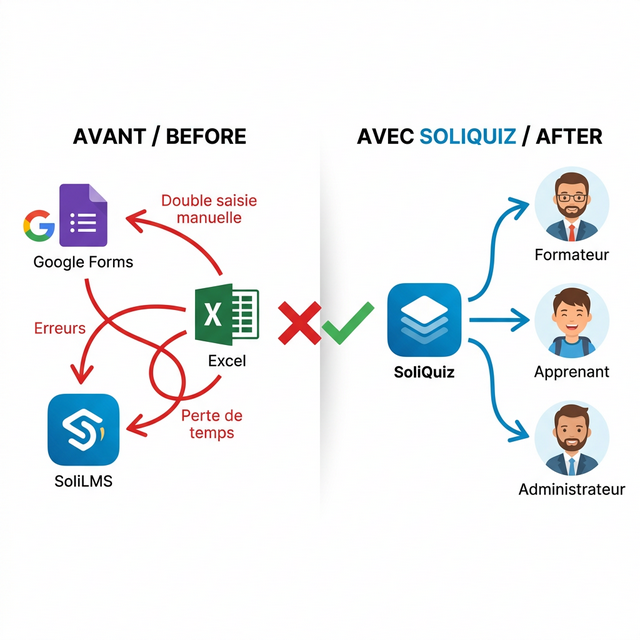
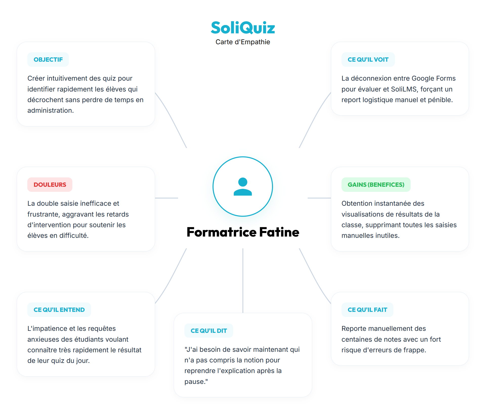
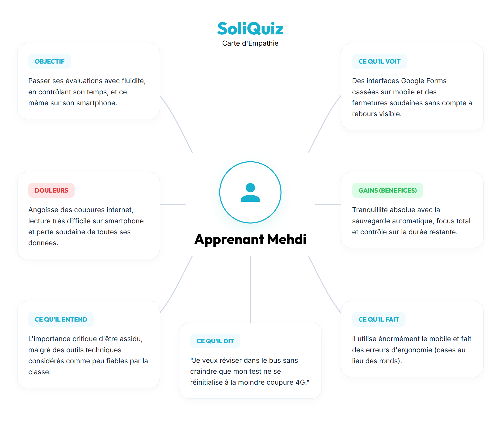
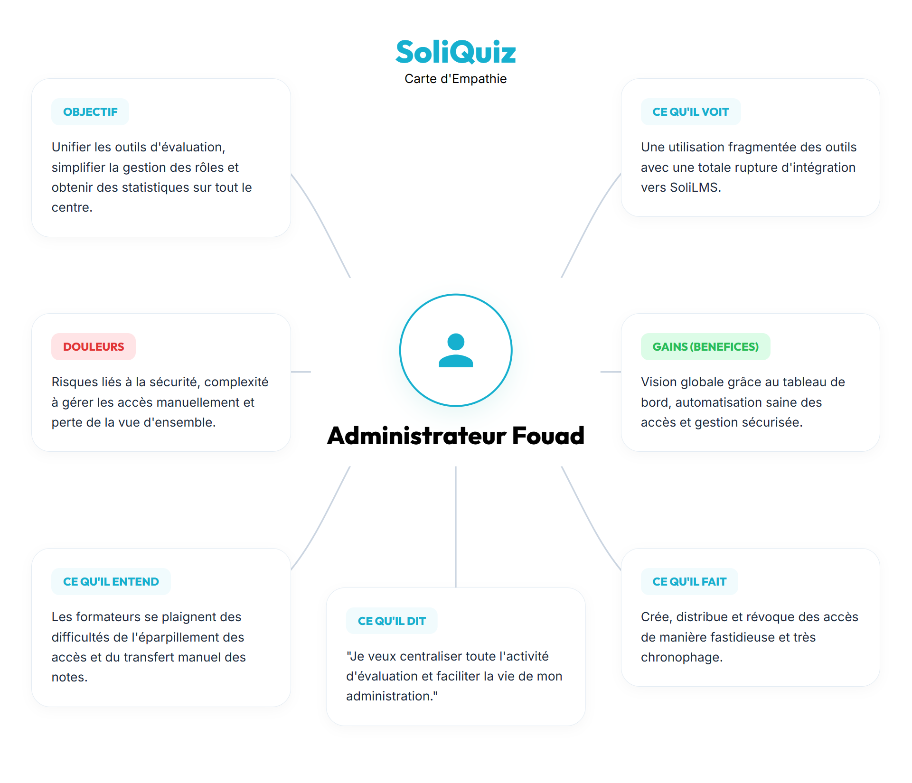
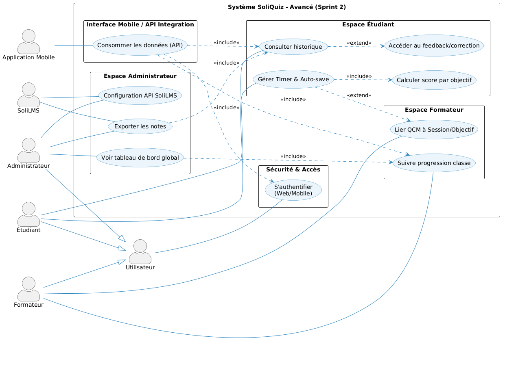
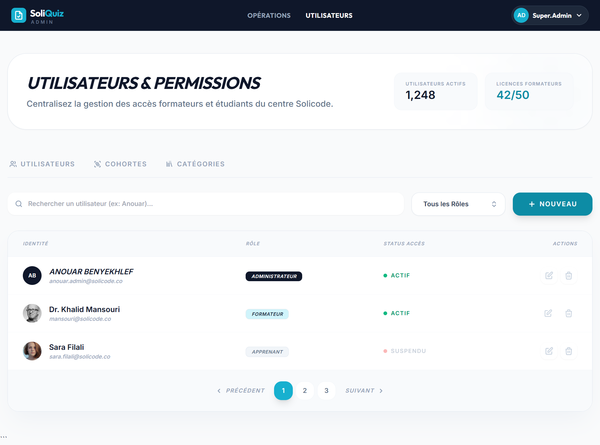

  
  

# **Projet de Fin de Formation**
### Système de Gestion & d'Auto-évaluation QCM — **SoliQuiz**

**Réalisé par :** BENYEKHLEF Anouar  
**Encadré par :** M. ESSARRAJ Fouad  
**Filière :** Développement Mobile

---

## Sommaire

  

1

Méthodologie de travail

  

2

Branche Fonctionnelle

  

3

Branche Technique

  

4

Conception

  

5

Conclusion

<!-- ---

## 1. Contexte du projet

 -->

---

## 1. Méthodologie : Design Thinking

---

## Méthodologie : Scrum (Agile)

---
<!-- 
## Méthodologie : Processus 2TUP

--- -->
<!-- 
## 3. Branche Fonctionnelle : Design Thinking

### 1. EMPATHIE :

--- -->

<!-- ## 3. Branche Fonctionnelle : Design Thinking -->
<!-- ### 1. EMPATHIE : Formateur (Youssef) -->

<!-- 

--- -->

<!-- ## 3. Branche Fonctionnelle : Design Thinking -->
<!-- ### 1. EMPATHIE : Formatrice (Fatine) -->

<!-- 

--- -->

<!-- ## 3. Branche Fonctionnelle : Design Thinking -->
<!-- ### 1. EMPATHIE : Apprenant (Soufiane) -->

<!-- 

--- -->

<!-- ## 3. Branche Fonctionnelle : Design Thinking -->
<!-- ### 1. EMPATHIE : Apprenant (Mehdi) -->

<!-- 

--- -->

<!-- ## 3. Branche Fonctionnelle : Design Thinking -->
<!-- ### 1. EMPATHIE : Administrateur (Fouad) -->

<!-- 

--- -->

## 2. Branche Fonctionnelle : Design Thinking
### 2. DÉFINITION : Cadrage du problème

  <h4 style="color: #e74c3c; text-transform: uppercase; letter-spacing: 1px; font-size: 0.8em; margin-bottom: 15px;">Énoncé du problème</h4>
  

    Les acteurs de Solicode <strong>ne disposent d'aucun outil d'évaluation unifié</strong>, les obligeant à jongler entre Google Forms, SoliLMS et Excel — entraînant une <strong>perte de temps, des erreurs de saisie et une absence de feedback pédagogique exploitable</strong> par objectif.
  

 

  

    <strong style="color: #f1c40f;">How Might We :</strong> Comment pourrions-nous offrir un outil d'évaluation QCM intégré qui automatise la correction, structure les résultats par objectif et fournit un feedback immédiat ?
  

---

## Branche Fonctionnelle : Design Thinking

### 3. IDÉATION : Cas d'utilisation (Plateforme Web & Application Mobile)

<!-- --- -->
<!-- ## Branche Fonctionnelle : Design Thinking -->
<!-- ### 3. IDÉATION : Cas d'utilisation (Plateforme Web & Application Mobile) -->

<!--  -->

---
## Branche Fonctionnelle : Cas d'utilisation (Web)
<!-- ### 3. IDÉATION : Cas d'utilisation (Plateforme Web) -->

---

## Branche Fonctionnelle : Cas d'utilisation (Apk)
<!-- ### 3. IDÉATION : Cas d'utilisation (Application Mobile) -->

<!-- ---

## Branche Fonctionnelle : Cas d'utilisation — Sprint 1 MVP

 -->

<!-- ---

## Branche Fonctionnelle : Cas d'utilisation — Sprint 2 Avancé

 -->

---

## Branche Fonctionnelle : Maquettage (Public Landing)

.png)

<!-- ---

## Branche Fonctionnelle : Maquettage (Admin Dashboard)

 -->

---

## Branche Fonctionnelle : Maquettage (Formateur Dashboard)

.png)

---

## Branche Fonctionnelle : Maquettage (Apprenant Dashboard)

.png)

---

## Branche Fonctionnelle : Maquettage (Mobile Dashboard)

.png)

---

## 3. Branche Technique : Tech Stack

  

    <h4>Back-end & Architecture</h4>
    <ul>
      <li><strong>PHP 8.2+ / Laravel 12</strong> (Framework MVC)</li>
      <li><strong>MySQL 8.0</strong> (Persistance des données)</li>
      <li><strong>Native PHP</strong> (Portage APK Mobile)</li>
      <li><strong>Spatie</strong> (Gestion des rôles & permissions)</li>
    </ul>
  

  

    <h4>Front-end & Outils</h4>
    <ul>
      <li><strong>Tailwind CSS & Preline</strong> (Mobile-First)</li>
      <li><strong>Alpine.js</strong> (Interactions dynamiques / Timer)</li>
      <!-- <li><strong>Tiptap</strong> (Éditeur de questions riches)</li> -->
      <li><strong>Vite</strong> (Build Tooling)</li>
    </ul>
  

---

## 4. Conception : Diagramme de classes

---

.png)

---

## 5. Conclusion

<!--  -->

 

---

### Merci pour votre attention ! 