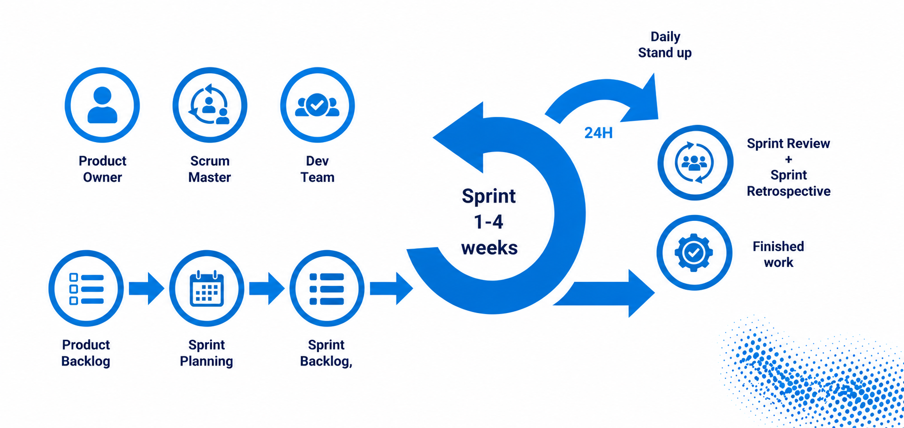
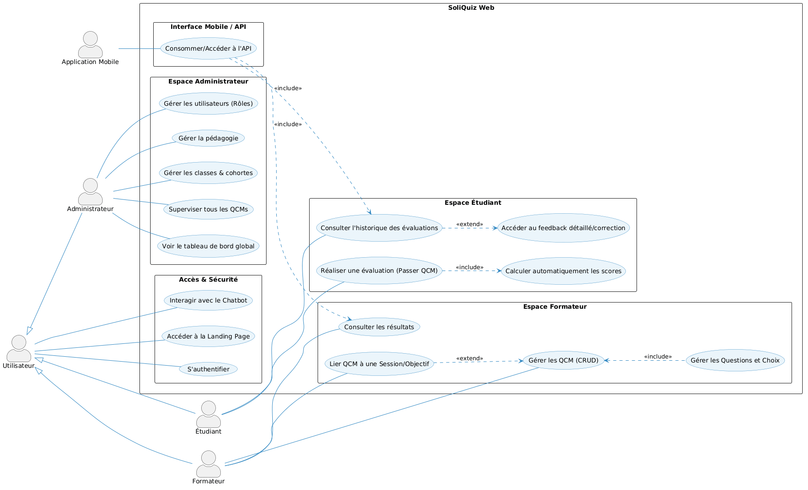
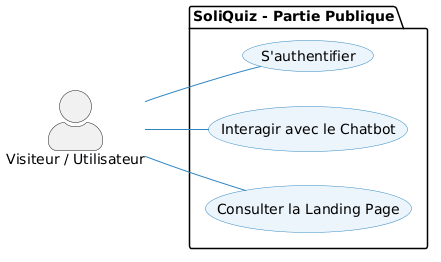
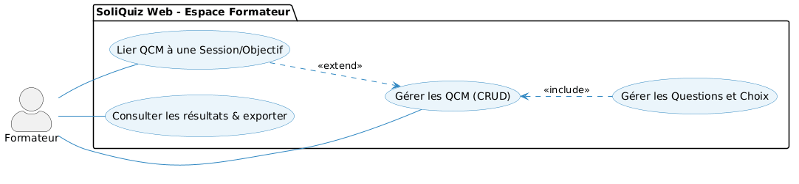
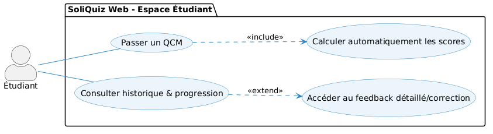
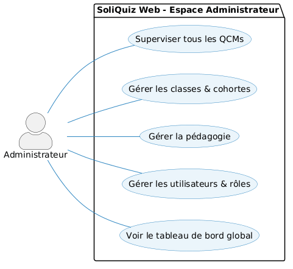
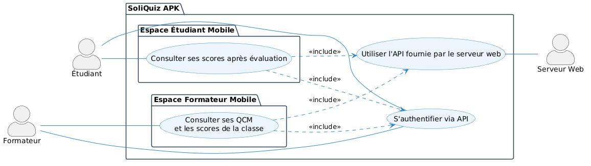
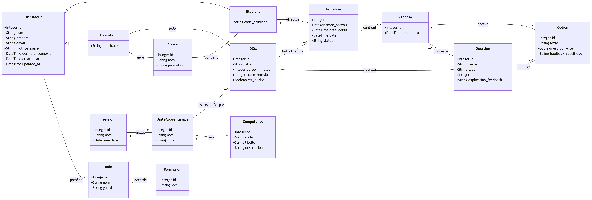

<!-- PAGE DE GARDE -->

  
  

# **Projet de Fin de Formation**
### Système de Gestion & d'Auto-évaluation QCM — **SoliQuiz**

**Réalisé par :** BENYEKHLEF Anouar  
**Encadré par :** M. ESSARRAJ Fouad  
**Filière :** Développement Mobile  
**Date de soutenance :** 12/06/2026

---

<!-- SOMMAIRE -->

## Sommaire

  

01

Contexte du projet

  

02

Méthodologie de Travail

  

03

Branche Fonctionnelle

  

04

Branche Technique

  

05

Conception

  

06

Démonstration

---

<!-- 01 CONTEXTE DU PROJET -->

## 01. Contexte du projet

---

<!-- 02 METHODOLOGIE : DESIGN THINKING -->

## 02. Méthodologie : Design Thinking

---

## 02. Méthodologie : Scrum (Agile)

---

<!-- 03 BRANCHE FONCTIONNELLE : CADRAGE DU PROBLEME -->

## 03. Branche Fonctionnelle
### Cadrage du problème

  <h4 style="color: #e74c3c; text-transform: uppercase; letter-spacing: 1px; font-size: 0.8em; margin-bottom: 15px;">Énoncé du problème</h4>
  <ul style="font-size: 1.05em; color: #2c3e50; line-height: 1.8; margin: 0; padding-left: 20px;">
    <li><strong>Aucun outil d'évaluation unifié</strong> à Solicode</li>
    <li>Outils dispersés : Google Forms, SoliLMS, Excel</li>
    <li><strong>Perte de temps</strong> et erreurs de saisie</li>
    <li>Absence de <strong>feedback pédagogique</strong> par objectif</li>
  </ul>

 

  

    <strong style="color: #f1c40f;">HMW :</strong> Offrir un outil QCM intégré → correction auto + résultats par objectif + feedback immédiat
  

---

<!-- 03 BRANCHE FONCTIONNELLE : CAS D'UTILISATION GLOBAL -->

## 03. Branche Fonctionnelle

## Branche Fonctionnelle : Cas d'utilisation (Web)

---

## Branche Fonctionnelle : Partie Publique

---

## Branche Fonctionnelle : Espace Formateur

---

## Branche Fonctionnelle : Espace Étudiant

---

## Branche Fonctionnelle : Espace Administrateur

---

## Branche Fonctionnelle : Cas d'utilisation (Mobile APK & API)

---

<!-- 04 BRANCHE TECHNIQUE -->

## 04. Branche Technique : Stack Technologique

  

    <h4 style="margin: 0 0 5px 0;">Back-end</h4>
    <ul style="margin: 0; padding-left: 20px;">
      <li style="margin-bottom: 2px;"><strong>PHP 8.2+</strong></li>
      <li style="margin-bottom: 2px;"><strong>Laravel 12</strong> (Framework MVC)</li>
      <li style="margin-bottom: 2px;"><strong>MySQL 8.0</strong> (Base de données)</li>
      <li style="margin-bottom: 2px;"><strong>PHP Native</strong> (Portage APK Mobile)</li>
      <li style="margin-bottom: 2px;"><strong>N8N</strong> (Automatisation de workflows)</li>
    </ul>
  

  

    <h4 style="margin: 0 0 5px 0;">Front-end & Outils</h4>
    <ul style="margin: 0; padding-left: 20px;">
      <li style="margin-bottom: 2px;"><strong>Tailwind CSS</strong> (Utility-First CSS)</li>
      <li style="margin-bottom: 2px;"><strong>Preline UI</strong> (Composants UI)</li>
      <li style="margin-bottom: 2px;"><strong>Alpine.js</strong> (Interactions dynamiques)</li>
      <li style="margin-bottom: 2px;"><strong>Vite</strong> (Build Tooling)</li>
      <li style="margin-bottom: 2px;"><strong>Lucide Icons</strong> (Icônes SVG)</li>
    </ul>
  

---

## 04. Branche Technique : Architecture

  

    <h4 style="margin: 0 0 5px 0;">MVC (Model – View – Controller)</h4>
    <ul style="margin: 0; padding-left: 20px;">
      <li style="margin-bottom: 4px;"><strong>Model</strong> — Eloquent ORM, relations, accesseurs</li>
      <li style="margin-bottom: 4px;"><strong>View</strong> — Blade + Alpine.js + Tailwind</li>
      <li style="margin-bottom: 4px;"><strong>Controller</strong> — Orchestration des requêtes HTTP</li>
    </ul>
  

  

    <h4 style="margin: 0 0 5px 0;">N-Tiers (Couche Service)</h4>
    <ul style="margin: 0; padding-left: 20px;">
      <li style="margin-bottom: 4px;"><strong>Controller</strong> → Validation & routing</li>
      <li style="margin-bottom: 4px;"><strong>Service</strong> → Logique métier (QCM, Scoring, Passation)</li>
      <li style="margin-bottom: 4px;"><strong>Repository / Model</strong> → Accès aux données</li>
    </ul>
  

---

<!-- 05 CONCEPTION : DIAGRAMME DE CLASSES -->

## 05. Conception : Diagramme de classes

---

---

<!-- 06 DEMONSTRATION -->

## 06. Démonstration

  

  <h3 style="color: #3498DB; font-size: 1.8em; margin-bottom: 10px;">Démonstration en direct</h3>
  

    Parcours complet de la plateforme SoliQuiz — Création de QCM, passation, correction automatique et tableau de bord analytique.
  

---

<!-- CONCLUSION -->

## Conclusion

- **Plateforme unifiée** d'évaluation QCM (Web + Mobile)
- **Correction automatique** et feedback par objectif
- **Architecture robuste** (MVC, N-Tiers, Services)
- **Méthodologie Agile** et Design Thinking

---

### Merci pour votre attention !