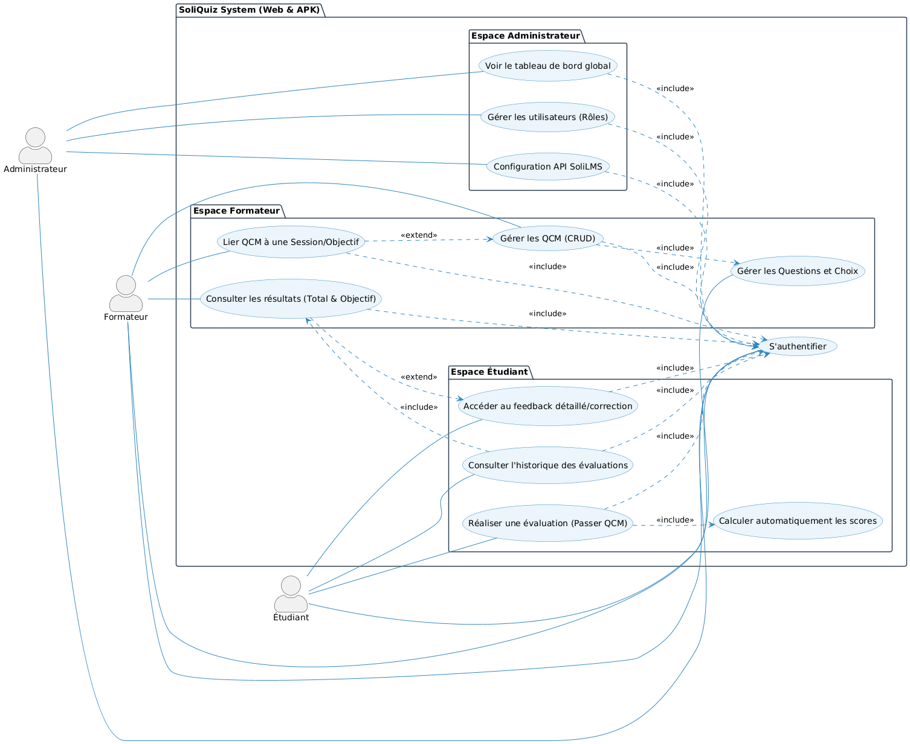

  
  

# **Projet de Fin de Formation**
### Système de QCM Interactif — **SoliQuiz**

**Réalisé par :** BENYEKHLEF Anouar  
**Encadré par :** M. ESSARRAJ Fouad  
**Filière :** Développement Mobile et Web

---

## Sommaire

  

1

Contexte du projet

  

2

Méthodologie de travail

  

3

Branche Fonctionnelle

  

4

Branche Technique

  

5

Conception

  

6

Démonstration

  

7

Conclusion

---

## 1. Contexte du projet

  

    <h4>Contexte</h4>
    
Les formateurs de Solicode font face à une gestion administrative lourde : double saisie, correction manuelle et manque de visibilité sur l'acquisition des compétences.

    
Ce projet analyse leurs besoins pour proposer une solution optimisant leur workflow et leur performance professionnelle.

  

  

    <h4>Cadre du Projet</h4>
    
Projet de fin de formation visant à centraliser les évaluations et supprimer les frictions entre Google Forms et SoliLMS.

    
<strong>SoliQuiz</strong> automatise le scoring par micro-objectif et synchronise les notes pour un suivi pédagogique précis.

  

---

## 2. Méthodologie : Design Thinking

  

---

## Méthodologie : Scrum (Agile)

  

---

## Méthodologie : Processus 2TUP

  

---

## 3. Branche Fonctionnelle : Design Thinking
### 1. EMPATHIE : Comprendre l'utilisateur

  

    <strong style="color: #088dc7;">Youssef (Formateur)</strong>
    
Passe 40% de son temps à corriger manuellement des QCM Google Forms et à recopier les notes sur SoliLMS. Il veut automatiser son suivi pédagogique mais n'a aucun outil pour lier ses questions aux objectifs du bootcamp.

  

  
  

    <strong style="color: #e74c3c;">Soufiane (Étudiant)</strong>
    
Cherche à comprendre ses lacunes après chaque test mais ne reçoit que des scores bruts (ex: 12/20) sans explication. Il finit par réviser au hasard car il n'a aucun feedback détaillé sur les compétences non acquises.

  

  
  

    <strong style="color: #27ae60;">Fouad (Administrateur)</strong>
    
Doit superviser les performances de plusieurs cohortes sans aucun tableau de bord centralisé. Il est incapable de détecter les décrochages en temps réel car les données sont dispersées entre Excel et Facebook.

  

---

## Branche Fonctionnelle : Design Thinking
### 2. DÉFINITION : Cadrage du problème

  <h4 style="color: #e74c3c; text-transform: uppercase; letter-spacing: 1px; font-size: 0.8em; margin-bottom: 15px;">Point de Vue (POV)</h4>
  

    "Les formateurs et apprenants de Solicode subissent une <strong>fracture numérique</strong> entre Google Forms, Excel et SoliLMS, provoquant une perte de temps administrative et une opacité pédagogique totale."
  

 

  

    <strong style="color: #f1c40f;">How Might We :</strong> Créer un pont numérique qui automatise l'évaluation et révèle les compétences en temps réel ?
  

---

## Branche Fonctionnelle : Design Thinking
### 3. IDÉATION
#### Solutions retenues

  

    <strong>~ Plateforme centralisée (Web & APK) de gestion des QCM.</strong>
  

  

    <strong>~ Création et structuration des tests par micro-objectifs pédagogiques.</strong>
  

  

    <strong>~ Passation sécurisée avec feedback immédiat pour les étudiants.</strong>
  

  

    <strong>~ Tableau de bord de suivi et synchronisation automatique vers SoliLMS.</strong>
  

---

## Branche Fonctionnelle : Cas d'utilisation

  <h3>Interaction Utilisateur — Vue globale (UML)</h3>
  

---

## Branche Fonctionnelle : Cas d'utilisation — Sprint 1 MVP

  

---

## Branche Fonctionnelle : Cas d'utilisation — Sprint 2 Avancé

  

---

## Branche Fonctionnelle : Maquettes (UI/UX)

  

    
    
Interface Administration

  

---

## 4. Branche Technique : Tech Stack

  

    <h4>Back-end & Architecture</h4>
    <ul>
      <li><strong>PHP 8.2+ / Laravel 12</strong> (Framework MVC)</li>
      <li><strong>MySQL 8.0</strong> (Persistance des données)</li>
      <li><strong>Native PHP</strong> (Portage APK Mobile)</li>
      <li><strong>Spatie</strong> (Gestion des rôles & permissions)</li>
    </ul>
  

  

    <h4>Front-end & Outils</h4>
    <ul>
      <li><strong>Tailwind CSS & Preline</strong> (Mobile-First)</li>
      <li><strong>Alpine.js</strong> (Interactions dynamiques / Timer)</li>
      <li><strong>Tiptap</strong> (Éditeur de questions riches)</li>
      <li><strong>Vite</strong> (Build Tooling)</li>
    </ul>
  

---

## 5. Conception : Diagramme de classe

 <h3>Modélisation des données (MLD)</h3>

 
  

---

## 6. Démonstration : Environnement & Outils

  

    <h4>Environnement de Développement</h4>
    <ul>
      <li><strong>IDE :</strong> VS Code & Antigravity</li>
      <li><strong>Monitoring DB :</strong> MySQL Workbench</li>
      <li><strong>Navigateur :</strong> Chrome DevTools</li>
    </ul>
  

  

    <h4>Gestion & Déploiement</h4>
    <ul>
      <li><strong>Modélisation UML :</strong> Mermaid / PlantUML</li>
      <li><strong>Gestion de version :</strong> Git (GitHub)</li>
    </ul>
  

 

---

## 7. Conclusion

  

    <strong>~ Objectifs :</strong> Solution QCM centralisée, Mobile-First et interconnectée (SoliLMS).
  

  

    <strong>~ Expertise :</strong> Maîtrise du cycle Agile, de 2TUP et de l'écosystème Full-stack Laravel.
  

  

    <strong>~ Impact :</strong> Suppression de la double saisie et apport d'un feedback granulaire par micro-objectif.
  

  

    <strong>~ Demain :</strong> Intelligence Artificielle pour la génération et l'analyse prédictive des tests.
  

 

---

### Merci pour votre attention ! 