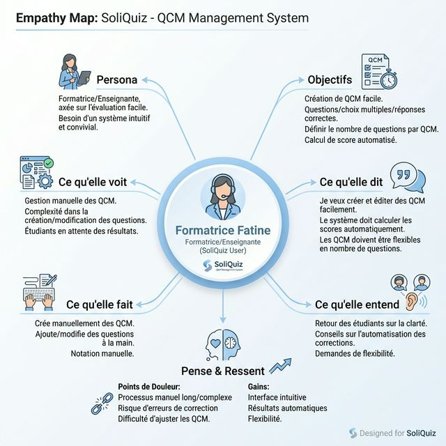
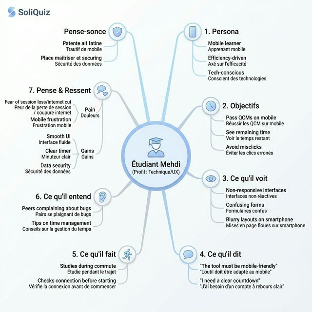
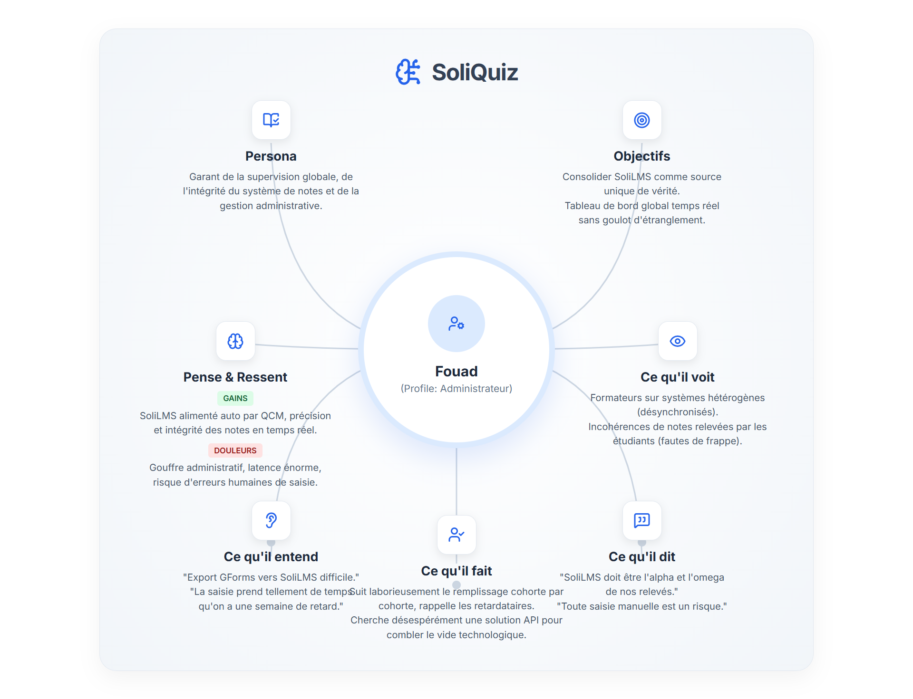
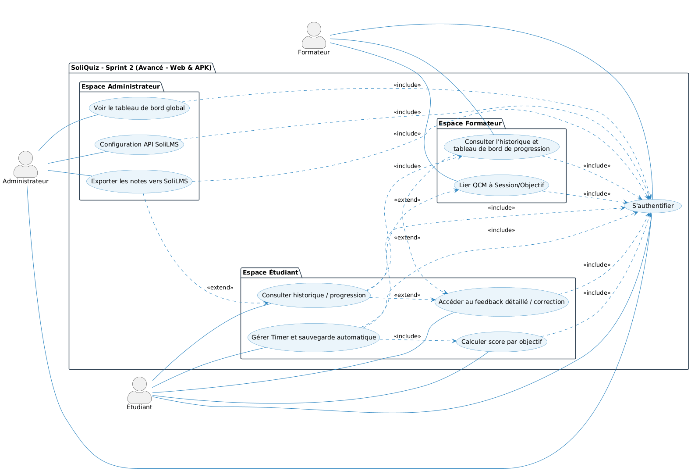

# Branche fonctionnelle

## Interviews d'empathie

### Synthèse des entretiens

Afin de cerner au mieux les attentes liées à la gestion des évaluations, nous avons mené des entretiens d'empathie avec les différents acteurs (formateurs, étudiants, administrateur). Voici les principaux constats et besoins qui en ressortent :

- **Les Formateurs (Youssef & Fatine)** : Ils subissent une perte de temps considérable liée à la double saisie des notes et à un manque de centralisation (Google Forms vs SoliLMS). Leurs besoins majeurs sont : la création simple de QCM, une gestion par objectif pédagogique et une automatisation du calcul et de la remontée des notes.
- **Les Étudiants (Mehdi & Soufiane)** : Ils sont frustrés par l'ergonomie (illisible sur mobile) et l'absence de feedback immédiat. Ils réclament une interface "mobile-first" rassurante (sauvegarde en temps réel), une gestion claire du temps (Timer), et l'affichage de corrections détaillées pour cibler leurs révisions.
- **L'Administrateur (Fouad)** : Il pointe la lourdeur du report manuel et le manque de transparence. Ses besoins incluent un tableau de bord global, une gestion unifiée des accès (Security-first) et l'intégration API avec SoliLMS.

---

## Carte d’empathie
L’analyse par les cartes d’empathie a permis de cristalliser les besoins profonds des utilisateurs, allant du besoin d'autonomie des formateurs au besoin de sérénité technique des apprenants.







## Définition du problème

### Énoncé du Problème (Point de Vue)
Les formateurs et apprenants de Solicode **ne disposent d'aucun outil d'évaluation unifié**, ce qui les oblige à jongler entre Google Forms, SoliLMS et des fichiers Excel — entraînant une **perte de temps, des erreurs de saisie et une absence totale de feedback pédagogique exploitable** après chaque session de QCM.

### Impacts et problèmes secondaires
*   **Invisibilité des lacunes spécifiques** : L’impossibilité d'associer chaque question à un micro-objectif empêche d'identifier précisément les notions non comprises.
*   **Stagnation par manque de feedback** : Les étudiants reçoivent des notes "sèches" sans explications, les laissant dans le flou quant aux axes d'amélioration.
*   **Rupture de la continuité administrative** : L'absence de synchronisation avec SoliLMS impose un report manuel répétitif et chronophage des notes.
*   **Fragmentation de l'expérience** : L'absence d'interface adaptée (notamment sur mobile) génère une frustration technique et une baisse de l'engagement.

---

## Sprints backlog

Le développement est organisé en deux sprints prioritaires pour répondre aux douleurs identifiées :

### Sprint 1 : MVP (Éliminer la friction de base)
L'objectif est de remplacer Google Forms dès le premier sprint pour assurer le cycle vital :
1. **UC1-1 & UC1-2** : Créer la structure et le contenu d'un QCM (Web).
2. **UC1-3 & UC1-4** : Passer le test et obtenir un calcul automatique du score global.
3. **UC1-5 & UC1-6** : Authentification et gestion des comptes (Security-first).
4. **V1 APK** : Consultation des scores et QCM en lecture seule sur mobile.

### Sprint 2 : Fonctionnalités Avancées (Pédagogie & Analyse)
Focus sur la granularité analytique et l'engagement apprenant :
1. **UC_LINK_QCM & UC_SCORE** : Liaison session/objectif et score détaillé par compétence.
2. **UC_FEEDBACK** : Affichage de la correction détaillée avec explications justifiées.
3. **UC_TIMER** : Mise en place du compte à rebours et sauvegarde automatique (Focus Mehdi).
4. **UC_EXPORT & UC_API_CONFIG** : Intégration API pour l'export automatisé vers SoliLMS.
5. **UC_DASH_ADMIN** : Supervision globale du centre pour Fouad.

---

## Diagramme de cas d’utilisation

### Vue Sprint 1 (MVP)


### Vue Sprint 2 (Avancé)


### Vue Globale du Système


```{=openxml}
<w:p><w:r><w:br w:type="page"/></w:r></w:p>
```