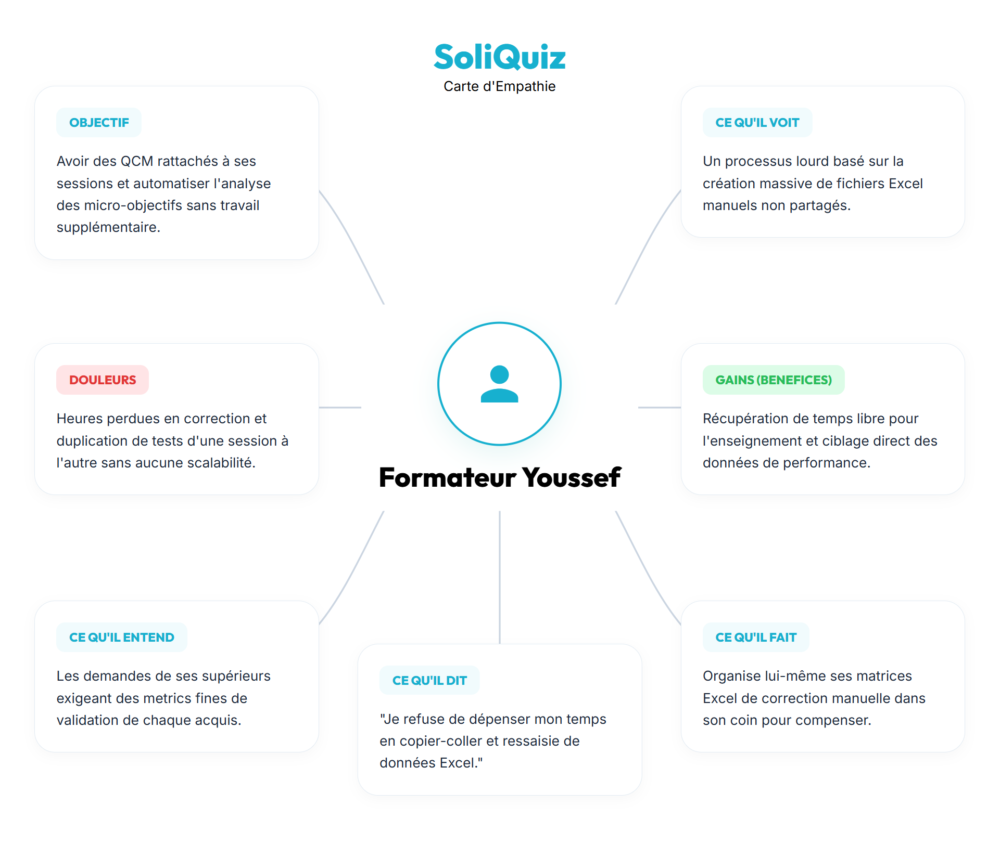
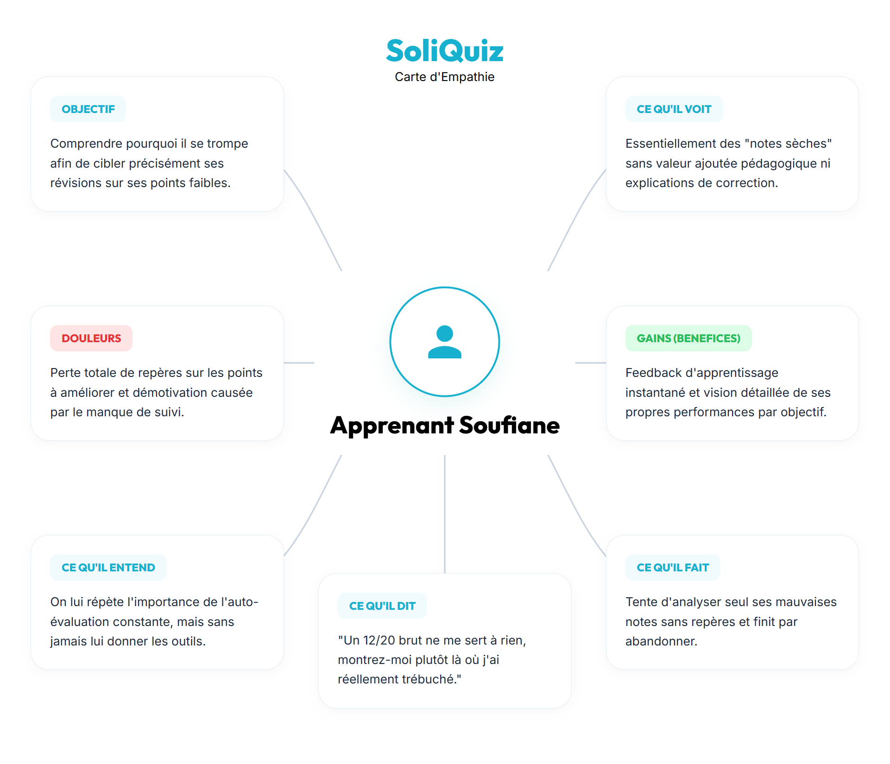
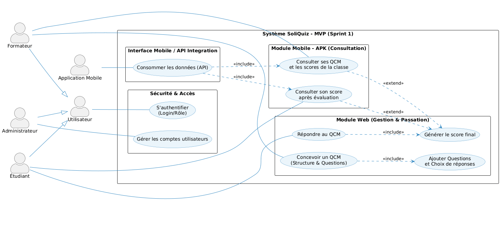
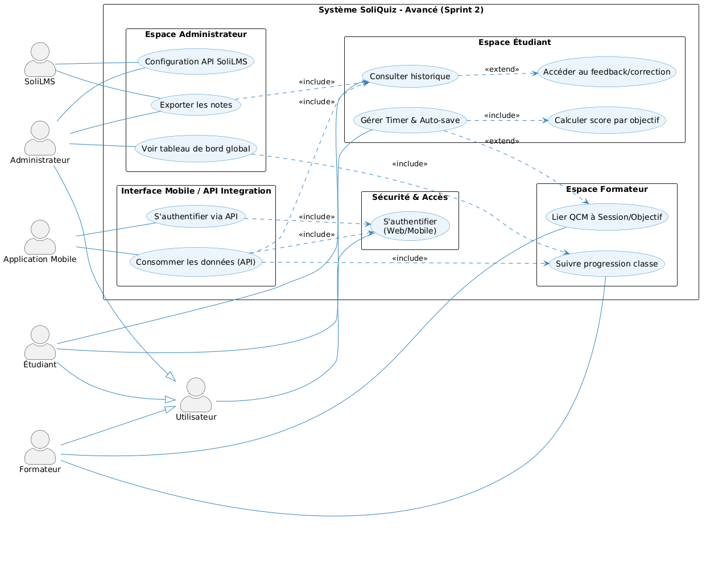

# Branche Fonctionnelle

## Analyse d'Empathie — Entretiens Terrain

**Date des entretiens :** 19 – 26 Février 2026
**Objectif :** Identifier les besoins critiques de chaque acteur afin de concevoir une solution qui élimine les frictions réelles et non supposées.

---

### 1.1 Profil : Formateur — Youssef
*L'évaluateur souhaitant passer du « Tableur Excel » à un outil intelligent par objectif.*

- **Vision :** Créer des QCM par session, obtenir des scores granulaires par micro-objectif et abolir la correction manuelle.
- **Points de Douleur (Pains) :**
    - **Correction chronophage :** La correction des évaluations et la saisie dans SoliLMS sont des tâches répétitives qui détournent de la mission pédagogique.
    - **Manque de granularité :** Avec Google Forms, il est impossible de calculer un score par objectif. Tout finit dans des fichiers Excel.
    - **Redondance inter-sessions :** Reproduire la même évaluation pour plusieurs sessions se résume à des copier-coller sans système d'intelligence.
- **Gains Attendus :**
    - Un QCM distinct et lié par session et par objectif pédagogique.
    - Un calcul automatique du score global **et** par objectif.
    - L'élimination totale de la saisie manuelle des résultats.



---

### 1.2 Profil : Formatrice — Fatine
*L'enseignante victime de la double saisie et du « suivi à l'aveugle ».*

- **Points de Douleur (Pains) :**
    - **Double saisie épuisante :** Utiliser Google Forms pour évaluer puis reporter manuellement dans SoliLMS génère des erreurs et frustre les étudiants.
    - **Suivi à l'aveugle :** Sans tableau de bord centralisé, il est impossible d'identifier d'un fait quels apprenants n'ont pas compris la notion du jour.
    - **Outil non adapté :** Google Forms ne permet ni la gestion des choix multiples pédagogiquement fondée, ni le calcul de score avancé.
- **Gains Attendus :**
    - Une interface de création de QCM simple avec CRUD complet.
    - Un calcul automatique du score sans intervention manuelle.
    - Un tableau de bord pour visualiser rapidement les résultats de la classe.


---

### 1.3 Profil : Apprenant — Mehdi
*L'étudiant stressé par l'ergonomie défaillante et la peur de perdre ses réponses.*

- **Points de Douleur (Pains) :**
    - **Mobile illisible :** Les formulaires Google Forms sont mal adaptés aux petits écrans, rendant les révisions pénibles.
    - **Angoisse des pertes de données :** Une coupure internet ou une actualisation accidentelle efface toutes les réponses — une source majeure de stress.
    - **Clôtures brutales :** L'absence de timer visible et d'alerte crée un sentiment d'injustice.
    - **Ambiguïté visuelle :** Il est impossible de distinguer si une question attend une ou plusieurs réponses.
- **Gains Attendus :**
    - Interface **Mobile-First** fluide et parfaitement lisible sur smartphone.
    - **Auto-sauvegarde** en temps réel des réponses.
    - Un **compte à rebours** toujours visible.
    - Distinction visuelle claire radio (unique) vs checkbox (multiple).


---

### 1.4 Profil : Apprenant — Soufiane
*L'étudiant qui reçoit des notes « sèches » sans valeur d'apprentissage.*

- **Points de Douleur (Pains) :**
    - **Note sans signification :** Recevoir "12/20" n'apporte aucune information exploitable pour progresser.
    - **Flou sur ses lacunes :** L'impossibilité de savoir pourquoi une réponse était fausse empêche toute révision ciblée.
    - **Démotivation progressive :** Sans vue de sa progression dans le temps, l'engagement diminue.
- **Gains Attendus :**
    - Un **feedback immédiat et détaillé** à la fin du test avec la correction et les explications.
    - Un **tableau de bord personnel** pour visualiser ses forces et faiblesses par objectif.
    - Une vue de sa **progression dans le temps**.



---

### 1.5 Profil : Administrateur — Fouad
*Le responsable pédagogique manquant de visibilité globale sur le centre.*

- **Points de Douleur (Pains) :**
    - **Opacité globale :** L'utilisation d'outils indépendants par équipe empêche la direction d'avoir une vue en temps réel de la progression du centre.
    - **Rupture avec SoliLMS :** Les notes ne remontent pas automatiquement dans le LMS central, créant des délais et des frictions.
    - **Gestion des accès éparpillée :** Créer et révoquer des accès sur des outils non-officiels est chronophage et risqué en termes de sécurité.
- **Gains Attendus :**
    - Un **tableau de bord centralisé** avec statistiques de réussite par cohorte et module.
    - Une **intégration API** avec SoliLMS pour synchroniser automatiquement les données.
    - Une gestion unifiée des rôles Formateur et Étudiant.


---

## Définition du Problème

### 2.1 Énoncé du Problème (Point de Vue)

Les formateurs et apprenants de Solicode **ne disposent d'aucun outil d'évaluation unifié**, ce qui les oblige à jongler entre Google Forms, SoliLMS et des fichiers Excel — entraînant une **perte de temps, des erreurs de saisie et une absence totale de feedback pédagogique exploitable** après chaque session de QCM.

### 2.2 Validation Terrain — Sources Directes

Ce problème est **explicitement confirmé par les 5 entretiens** menés en phase d'empathie :

| Persona | Frustration principale validée |
|:---|:---|
| **Fatine** (Formatrice) | Double saisie entre Google Forms et SoliLMS, risque d'erreurs, aucun tableau de bord |
| **Youssef** (Formateur) | Correction chronophage, calculs sur Excel, aucune granularité par objectif |
| **Fouad** (Admin) | Aucune vue globale du centre, pas de remontée auto dans SoliLMS |
| **Mehdi** (Étudiant) | Interface inadaptée au mobile, perte de données, aucun timer visible |
| **Soufiane** (Étudiant) | Score brut sans explication, révision impossible à cibler |

### 2.3 Cause Racine

L'absence d'un outil **conçu pour Solicode** et **intégré à son écosystème pédagogique** contraint chaque acteur à adapter des outils génériques non pensés pour la pédagogie par objectifs — générant friction, perte de temps et opacité pour tous.

### 2.4 Reformulation « How Might We »

> **Comment pourrions-nous** offrir aux acteurs de Solicode un outil d'évaluation QCM intégré, qui automatise la correction, structure les résultats par objectif pédagogique et fournit un feedback immédiat — éliminant ainsi la double saisie et l'opacité des résultats ?

---

## Idéation & Spécifications Fonctionnelles

Basé sur l'analyse d'empathie, voici la traçabilité directe de chaque problème vers sa solution fonctionnelle :

| Module | Problème Résolu | Persona(s) |
| :--- | :--- | :--- |
| **Création de QCM CRUD** | Double saisie et outils génériques inadaptés | Fatine, Youssef |
| **Score automatique global** | Correction manuelle chronophage | Fatine, Youssef |
| **Granularité par objectif** | Aucune visibilité par micro-objectif | Youssef |
| **Feedback détaillé** | Score brut sans explication | Soufiane |
| **Interface Mobile-First** | Illisibilité sur smartphone | Mehdi |
| **Auto-sauvegarde + Timer** | Perte de données, clôture brusque | Mehdi |
| **Tableau de bord Admin** | Opacité globale du centre | Fouad |
| **Intégration API SoliLMS** | Rupture administrative avec le LMS | Fouad |

---

## Planification Agile : Sprints et Backlogs

### 4.1 Vue Globale du Système (Acteurs)

Avant de détailler les sprints, voici l'architecture logicielle complète de SoliQuiz :

**Acteurs du système :**
- **L'Administrateur (Fouad) :** Contrôle total — gestion des utilisateurs et supervision globale.
- **Le Formateur (Youssef / Fatine) :** Cœur opérationnel — création et suivi des QCM.
- **L'Étudiant (Mehdi / Soufiane) :** Utilisateur final — passation et consultation.


---

### 4.2 Sprint 1 — MVP : Éliminer la Friction de Base

**Objectif :** Remplacer Google Forms dès le premier sprint en permettant aux formateurs de créer un QCM et aux étudiants de le passer avec un score automatique.

#### Backlog Sprint 1

| Catégorie | ID | Cas d'Utilisation | Description | Persona |
| :--- | :--- | :--- | :--- | :--- |
| **Authentification** | UC1-5 | Se connecter | Accès sécurisé selon le rôle (Admin / Formateur / Étudiant) | Tous |
| **Administration** | UC1-6 | Gérer les utilisateurs | Activer, attribuer les rôles et révoquer les accès | Fouad |
| **QCM** | UC1-1 | Créer un QCM | Titre, description, lien à une session et un formateur | Youssef, Fatine |
| **QCM** | UC1-2 | Ajouter questions & choix | Types : choix unique (radio) ou choix multiple (checkbox) | Youssef, Fatine |
| **Passation** | UC1-3 | Passer le QCM | Interface de test dédiée sur le Web pour l'étudiant | Mehdi, Soufiane |
| **Résultats** | UC1-4 | Score automatique | Correction et calcul du score global immédiatement à la soumission | Fatine, Soufiane |
| **Mobile V1** | UC1-MOB | Consultation mobile | Scores et QCM en lecture seule depuis l'APK | Mehdi |

**Résultat Attendu Sprint 1 :** Le formateur peut créer un QCM en moins de 3 minutes. L'étudiant peut le passer et obtenir son score immédiatement, sans aucune intervention manuelle de la part du formateur.



---

### 4.3 Sprint 2 — Avancé : Pédagogie, Analyse & Intégration

**Objectif :** Transformer SoliQuiz d'un simple outil de notation en un **écosystème pédagogique complet**, avec granularité analytique, feedback détaillé et intégration SoliLMS.

#### Backlog Sprint 2

| Axe | ID | Cas d'Utilisation | Description | Persona |
| :--- | :--- | :--- | :--- | :--- |
| **Pédagogie** | UC_LINK | Lier QCM à un objectif | Chaque QCM est associé à un micro-objectif et une session | Youssef |
| **Analyse** | UC_SCORE | Score par objectif | Score ventilé par compétence (ex: Logique 80%, Syntaxe 20%) | Youssef, Fouad |
| **Feedback** | UC_FEEDBACK | Correction détaillée | Affichage de la correction complète + explications justifiées | Soufiane |
| **Ergonomie** | UC_TIMER | Timer + auto-sauvegarde | Compte à rebours visible et sauvegarde en temps réel | Mehdi |
| **Progression** | UC_HISTORY | Historique étudiant | Suivi personnel de la montée en compétences par objectif | Soufiane |
| **Pilotage** | UC_DASH | Dashboard Admin | Supervision des taux de réussite par cohorte et par module | Fouad |
| **Intégration** | UC_EXPORT | Export vers SoliLMS | Notes finalisées envoyées via API sans saisie manuelle | Fouad, Youssef |
| **Intégration** | UC_API | Config API SoliLMS | L'admin configure les endpoints de synchronisation | Fouad |

**Résultat Final Sprint 2 :** SoliQuiz devient un véritable pont numérique. Le formateur analyse les lacunes par objectif ; l'étudiant comprend ses erreurs grâce au feedback ; l'administrateur pilote le centre en temps réel depuis son tableau de bord.



```{=openxml}
<w:p><w:r><w:br w:type="page"/></w:r></w:p>
```
```{=openxml}
<w:p><w:r><w:br w:type="page"/></w:r></w:p>
```