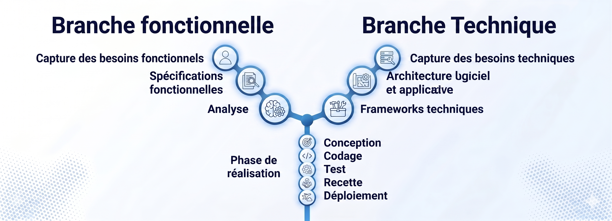
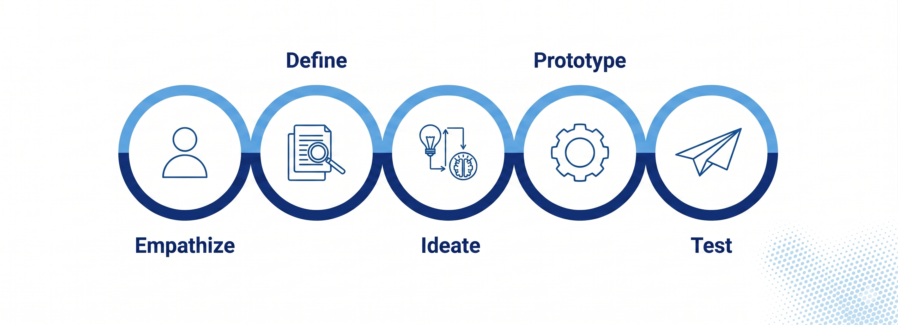
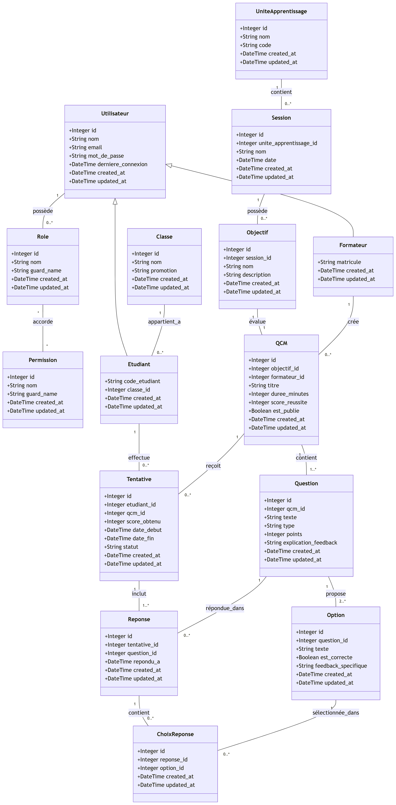
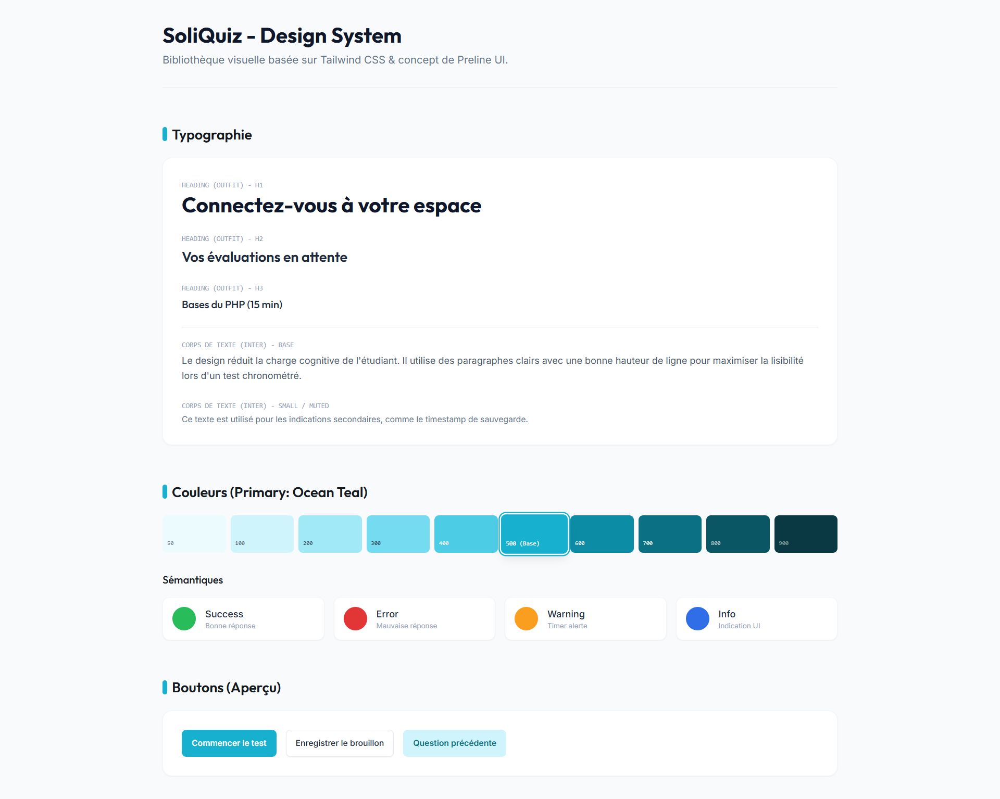
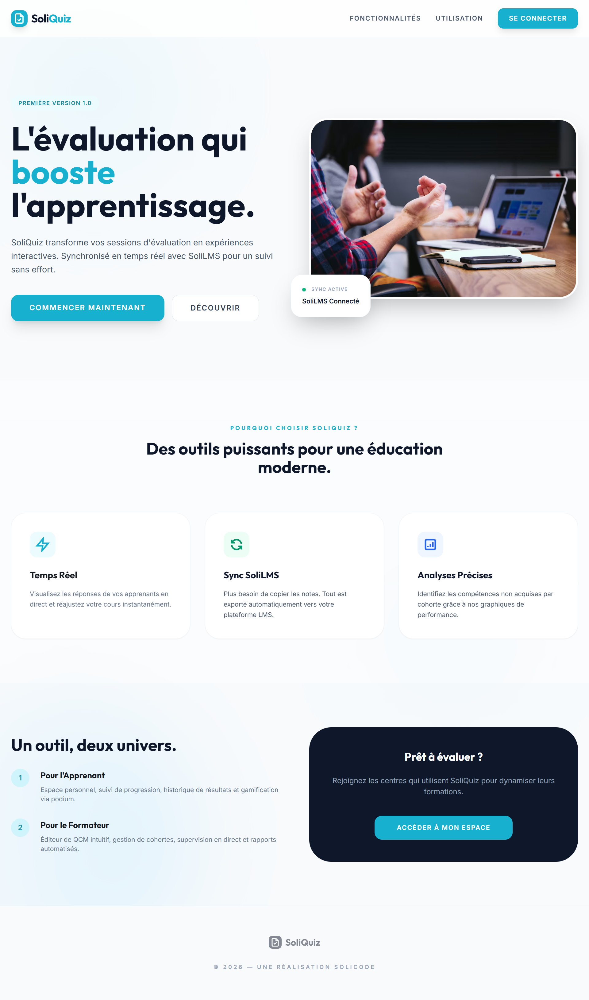
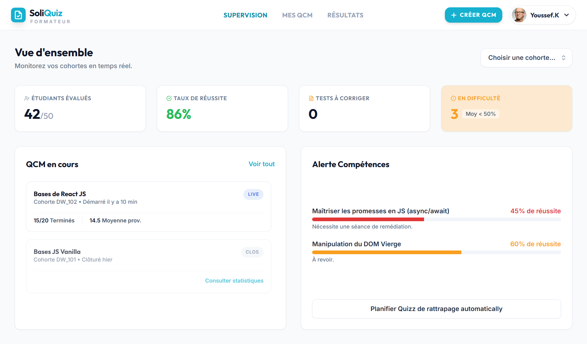
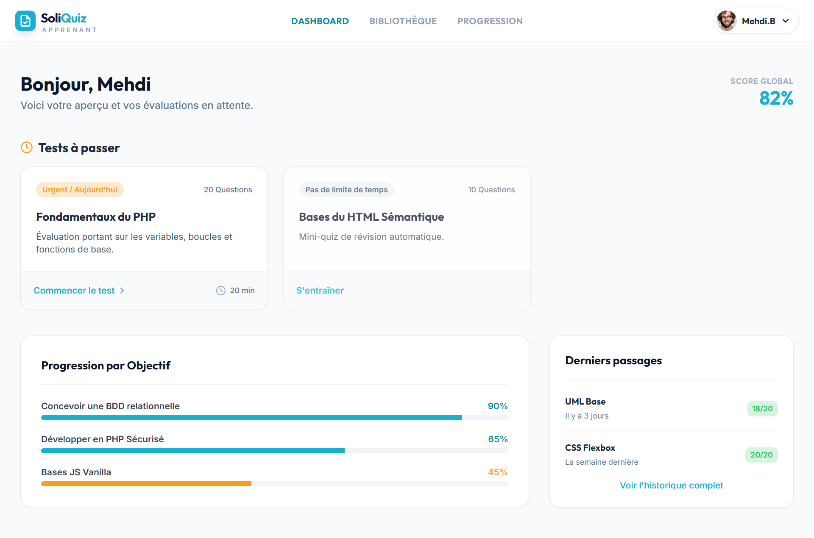
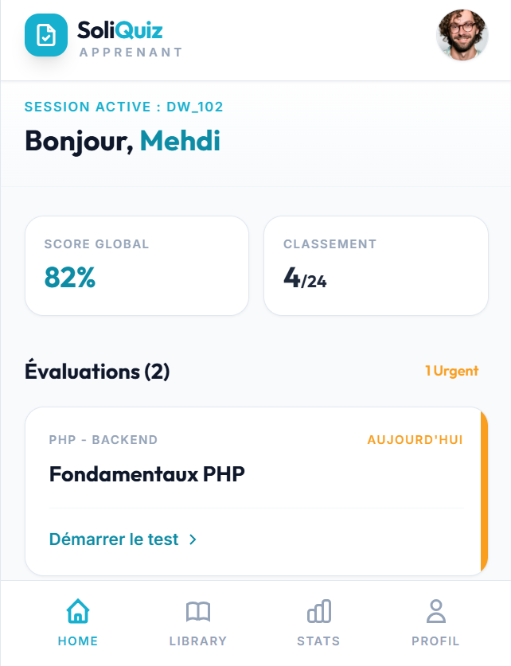

# Rapport Final de Projet — SoliQuiz
**Sujet :** Conception et Réalisation d'un Système de Gestion & d'Auto-évaluation QCM  
**Filière :** Formation de développement Mobile – Mode Bootcamp

**Présenté par :** BENYEKHLEF Anouar  
**Encadrant :** Mr. ESSARRAJ Fouad  
**Année de Formation 2025/2026 — SOLICODE, Tanger, Maroc**

---

## Table des matières

1. [Remerciement](#remerciement)
2. [Introduction](#introduction)
3. [Cahier des Charges — SoliQuiz](#cahier-des-charges--soliquiz)
   - 3.1 [Vision et Objectifs du Projet](#31-vision-et-objectifs-du-projet)
   - 3.2 [Contexte et Problématique](#32-contexte-et-problématique)
   - 3.3 [Profils Utilisateurs (Personas)](#33-profils-utilisateurs-personas)
   - 3.4 [Spécifications Fonctionnelles (Agilité)](#34-spécifications-fonctionnelles-agilité)
   - 3.5 [Exigences Non-Fonctionnelles](#35-exigences-non-fonctionnelles-qualité)
   - 3.6 [Critères d'Acceptation (DoD)](#36-critères-dacceptation-dod)
4. [Méthode de Travail](#méthode-de-travail)
   - 4.1 [La méthode SCRUM](#41-la-méthode-scrum)
   - 4.2 [La méthode 2TUP](#42-la-méthode-2tup)
   - 4.3 [Design Thinking](#43-design-thinking)
5. [Branche Fonctionnelle](#branche-fonctionnelle)
   - 5.1 [Analyse d'Empathie — Entretiens Terrain](#51-analyse-dempathie--entretiens-terrain)
     - [Profil : Formateur — Youssef](#511-profil--formateur--youssef)
     - [Profil : Formatrice — Fatine](#512-profil--formatrice--fatine)
     - [Profil : Apprenant — Mehdi](#513-profil--apprenant--mehdi)
     - [Profil : Apprenant — Soufiane](#514-profil--apprenant--soufiane)
     - [Profil : Administrateur — Fouad](#515-profil--administrateur--fouad)
   - 5.2 [Définition du Problème](#52-définition-du-problème)
   - 5.3 [Idéation & Spécifications Fonctionnelles](#53-idéation--spécifications-fonctionnelles)
   - 5.4 [Planification Agile : Sprints et Backlogs](#54-planification-agile--sprints-et-backlogs)
     - [Sprint 1 — MVP](#sprint-1--mvp--éliminer-la-friction-de-base)
     - [Sprint 2 — Avancé](#sprint-2--avancé--pédagogie-analyse--intégration)
6. [Branche Technique](#branche-technique)
    - 6.1 [Choix Technologiques](#61-choix-technologiques)
      - [Outils de Modélisation et Documentation](#outils-de-modélisation-et-documentation)
    - 6.2 [Architecture Système](#62-architecture-système)
    - 6.3 [Prototype — Espaces et Classes](#63-prototype--espaces-et-classes)
7. [Conception](#conception)
   - 7.1 [Diagramme de Classes](#71-diagramme-de-classes)
   - 7.2 [Maquettes (UI/UX)](#72-maquettes-uiux)
8. [Réalisation](#réalisation)
9. [Conclusion](#conclusion)

---

## Remerciement

Je tiens à exprimer ma profonde gratitude à Monsieur ESSARRAJ Fouad, notre formateur, pour son encadrement précieux, sa disponibilité et ses conseils pertinents tout au long de la réalisation de ce projet. Son expertise, sa rigueur et sa passion pour le développement logiciel ont grandement contribué à enrichir mes compétences techniques et professionnelles. Ce projet n'aurait pas vu le jour sans son accompagnement constant et ses remarques constructives qui m'ont permis de progresser étape par étape. Je remercie également toutes les personnes qui, de près ou de loin, ont apporté leur aide ou leur soutien durant cette aventure.

---

## Introduction

Nous avons conçu **SoliQuiz**, une application d'auto-évaluation quotidienne permettant aux développeurs de tester leurs connaissances. Entièrement connectée à **SoliLMS**, l'application synchronise automatiquement les données des apprenants et des formateurs. Elle offre un espace clair pour valider les acquis chaque jour, tout en automatisant la remontée des scores pour simplifier le suivi pédagogique.

---

## Cahier des Charges — SoliQuiz

> **Projet :** Système de Gestion & d'Auto-évaluation QCM  
> **Client :** Centre de formation Solicode (Bootcamp)

### 3.1 Vision et Objectifs du Projet

**SoliQuiz** est une application web et mobile (Android/APK) conçue pour digitaliser l'évaluation quotidienne au sein de Solicode. L'objectif est de remplacer les solutions génériques disparates par une plateforme unique capable de :
- **Automatiser** le cycle complet des QCM (création, passation, correction).
- **Tracer** l'acquisition des compétences via une granularité par micro-objectif.
- **Éliminer** la double saisie administrative via une intégration avec SoliLMS.
- **Améliorer** l'engagement des apprenants grâce à un feedback immédiat et une interface sans stress.

### 3.2 Contexte et Problématique

L'analyse de terrain (entretiens d'empathie) a révélé une **fragmentation critique des outils** (Google Forms, SoliLMS, Excel). Cette situation génère trois douleurs majeures :

1. **Opacité Pédagogique :** Les résultats fournis sous forme de "scores bruts" (ex: 12/20) ne permettent pas de savoir quels micro-objectifs sont échoués.
2. **Lourdeur Administrative :** Le report manuel des notes de Google Forms vers SoliLMS est chronophage et source d'erreurs.
3. **Friction Technique :** L'absence d'interface mobile fluide et de sauvegarde automatique génère une angoisse de perte de données.

> **How Might We :** Offrir aux acteurs de Solicode un outil d'évaluation QCM intégré, qui automatise la correction, structure les résultats par objectif pédagogique et fournit un feedback immédiat — éliminant ainsi la double saisie et l'opacité des résultats ?

### 3.3 Profils Utilisateurs (Personas)

| Profil | Rôle | Besoins Clés |
|---|---|---|
| **L'Étudiant** (Mehdi / Soufiane) | Passer les tests et apprendre | Mobile-first, auto-sauvegarde, timer, feedback explicatif immédiat, tableau de bord de progression. |
| **Le Formateur** (Youssef / Fatine) | Évaluer et ajuster son cours | CRUD QCM rapide, liaison par objectifs, calcul auto des scores, analyse granulaire de la classe. |
| **L'Administrateur** (Fouad) | Superviser et synchroniser | Supervision globale du centre, gestion des accès (Security-first), synchronisation API avec SoliLMS. |

### 3.4 Spécifications Fonctionnelles (Agilité)

#### Sprint 1 : MVP (Minimum Viable Product)
- **Sécurité Basique :** Authentification sécurisée avec redirection selon le rôle.
- **Moteur QCM (CRUD) :** Création de QCM, gestion des questions (choix unique/multiple).
- **Cycle de Passation :** Interface de test avec correction et calcul automatique du score global.
- **APK Mobile (V1) :** Consultation des scores et des QCM en lecture seule.

#### Sprint 2 : Version Avancée & Analytique
- **Granularité par Objectif :** Liaison des QCM à des sessions/micro-objectifs.
- **Feedback Pédagogique :** Affichage de la correction détaillée avec explications justifiées.
- **Expérience "Stress-Free" :** Timer (compte à rebours) et sauvegarde automatique en temps réel.
- **Pilotage et Intégration :** Dashboard global et export automatisé vers SoliLMS via API.

### 3.5 Exigences Non-Fonctionnelles (Qualité)

- **Performance :** Chargement instantané des pages et faible consommation de données pour l'APK.
- **Disponibilité :** Mode "dégradé" permettant la poursuite du test en cas de micro-coupure internet.
- **Ergonomie :** Différenciation visuelle stricte entre boutons radio (choix unique) et checkboxes (choix multiples).
- **Accessibilité :** Lisibilité irréprochable sur smartphone (Mobile-First).

### 3.6 Critères d'Acceptation (DoD)

1. Le formateur peut créer un QCM fonctionnel en moins de 3 minutes.
2. L'étudiant peut achever son test sur smartphone même après une perte de connexion.
3. L'export des notes vers SoliLMS s'effectue sans aucune saisie manuelle.
4. Chaque test génère un feedback compréhensible permettant à l'apprenant d'identifier ses lacunes.

---

## Méthode de Travail

### 4.1 La méthode SCRUM

La méthodologie Scrum est une méthodologie agile qui permet de gérer un projet de manière flexible et collaborative, en favorisant la livraison progressive de fonctionnalités. Elle repose sur l'itération, la priorisation des tâches et la communication régulière.

**Principes clés**
- **Transparence** : Toutes les tâches et objectifs sont visibles par l'équipe.
- **Inspection** : Chaque sprint est évalué pour détecter les améliorations possibles.
- **Adaptation** : L'équipe ajuste le plan de travail selon les résultats des sprints précédents.

### 4.2 La méthode 2TUP

La méthodologie 2TUP (Two-Tracks Unified Process) est un processus de développement logiciel qui s'appuie sur une structure en forme de **Y**. Elle propose de séparer puis de synchroniser deux dimensions essentielles :
- L'analyse fonctionnelle (ce que doit faire le système),
- La conception technique (comment le réaliser).

**La structure en Y**
- **Branche fonctionnelle** : Capture des besoins et analyse des cas d'usage.
- **Branche technique** : Choix de l'architecture et des technologies.
- **Phase de convergence** : Développement, tests et livraison.

### 4.3 Design Thinking

C'est une méthode de résolution de problèmes centrée sur l'humain, qui consiste à comprendre en profondeur les besoins des utilisateurs afin de concevoir des solutions innovantes.

**Les cinq étapes**
1. **Empathie** : Comprendre l'utilisateur (entretiens avec les acteurs de Solicode).
2. **Définition** : Formuler un problème clair (How Might We).
3. **Idéation** : Générer un maximum d'idées et de cas d'utilisation.
4. **Prototype** : Création de maquettes simplifiées.
5. **Test** : Recueillir les avis des utilisateurs pour affiner la solution.

---

## Branche Fonctionnelle

### 5.1 Analyse d'Empathie — Entretiens Terrain

**Date des entretiens :** 19 – 26 Février 2026  
**Objectif :** Identifier les besoins critiques de chaque acteur afin de concevoir une solution qui élimine les frictions réelles et non supposées.

---

#### 5.1.1 Profil : Formateur — Youssef
*L'évaluateur souhaitant passer du « Tableur Excel » à un outil intelligent par objectif.*

- **Points de Douleur (Pains) :**
    - **Correction chronophage :** La correction et la saisie dans SoliLMS détournent de la mission pédagogique.
    - **Manque de granularité :** Avec Google Forms, impossible de calculer un score par objectif. Tout finit dans des fichiers Excel.
    - **Redondance inter-sessions :** Reproduire la même évaluation pour plusieurs sessions se résume à des copier-coller sans intelligence.
- **Gains Attendus :**
    - Un QCM distinct et lié par session et par objectif pédagogique.
    - Un calcul automatique du score global **et** par objectif.
    - L'élimination totale de la saisie manuelle des résultats.

---

#### 5.1.2 Profil : Formatrice — Fatine
*L'enseignante victime de la double saisie et du « suivi à l'aveugle ».*

- **Points de Douleur (Pains) :**
    - **Double saisie épuisante :** Google Forms → SoliLMS génère des erreurs et frustre les étudiants.
    - **Suivi à l'aveugle :** Sans tableau de bord, impossible d'identifier quels apprenants n'ont pas compris.
    - **Outil non adapté :** Google Forms ne permet ni la gestion des choix multiples, ni le calcul de score avancé.
- **Gains Attendus :**
    - Interface de création de QCM simple avec CRUD complet.
    - Calcul automatique du score sans intervention manuelle.
    - Tableau de bord pour visualiser les résultats de la classe.

---

#### 5.1.3 Profil : Apprenant — Mehdi
*L'étudiant stressé par l'ergonomie défaillante et la peur de perdre ses réponses.*

- **Points de Douleur (Pains) :**
    - **Mobile illisible :** Les formulaires Google Forms sont mal adaptés aux petits écrans.
    - **Angoisse des pertes de données :** Une coupure internet efface toutes les réponses.
    - **Clôtures brutales :** L'absence de timer visible et d'alerte crée un sentiment d'injustice.
    - **Ambiguïté visuelle :** Impossible de distinguer si une question attend une ou plusieurs réponses.
- **Gains Attendus :**
    - Interface **Mobile-First** fluide et parfaitement lisible.
    - **Auto-sauvegarde** en temps réel.
    - Un **compte à rebours** toujours visible.
    - Distinction visuelle radio (unique) vs checkbox (multiple).

---

#### 5.1.4 Profil : Apprenant — Soufiane
*L'étudiant qui reçoit des notes « sèches » sans valeur d'apprentissage.*

- **Points de Douleur (Pains) :**
    - **Note sans signification :** Recevoir "12/20" n'apporte aucune information exploitable.
    - **Flou sur ses lacunes :** Impossible de savoir pourquoi une réponse était fausse.
    - **Démotivation progressive :** Sans vue de sa progression dans le temps, l'engagement diminue.
- **Gains Attendus :**
    - Un **feedback immédiat et détaillé** avec la correction et les explications.
    - Un **tableau de bord personnel** pour visualiser ses forces et faiblesses par objectif.
    - Une vue de sa **progression dans le temps**.

---

#### 5.1.5 Profil : Administrateur — Fouad
*Le responsable pédagogique manquant de visibilité globale sur le centre.*

- **Points de Douleur (Pains) :**
    - **Opacité globale :** Les outils indépendants empêchent une vue en temps réel de la progression du centre.
    - **Rupture avec SoliLMS :** Les notes ne remontent pas automatiquement dans le LMS central.
    - **Gestion des accès éparpillée :** Créer et révoquer des accès sur des outils non-officiels est chronophage et risqué.
- **Gains Attendus :**
    - Un **tableau de bord centralisé** avec statistiques par cohorte et module.
    - Une **intégration API** avec SoliLMS pour synchroniser automatiquement les données.
    - Une gestion unifiée des rôles Formateur et Étudiant.

---

### 5.2 Définition du Problème

**Énoncé du Problème :** Les formateurs et apprenants de Solicode **ne disposent d'aucun outil d'évaluation unifié**, ce qui les oblige à jongler entre Google Forms, SoliLMS et des fichiers Excel — entraînant une **perte de temps, des erreurs de saisie et une absence totale de feedback pédagogique exploitable** après chaque session de QCM.

**Validation Terrain :**

| Persona | Frustration principale validée |
|:---|:---|
| **Fatine** (Formatrice) | Double saisie entre Google Forms et SoliLMS, risque d'erreurs, aucun tableau de bord |
| **Youssef** (Formateur) | Correction chronophage, calculs sur Excel, aucune granularité par objectif |
| **Fouad** (Admin) | Aucune vue globale du centre, pas de remontée auto dans SoliLMS |
| **Mehdi** (Étudiant) | Interface inadaptée au mobile, perte de données, aucun timer visible |
| **Soufiane** (Étudiant) | Score brut sans explication, révision impossible à cibler |

**Cause Racine :** L'absence d'un outil **conçu pour Solicode** et **intégré à son écosystème pédagogique** contraint chaque acteur à adapter des outils génériques non pensés pour la pédagogie par objectifs.

> **Comment pourrions-nous** offrir aux acteurs de Solicode un outil d'évaluation QCM intégré, qui automatise la correction, structure les résultats par objectif pédagogique et fournit un feedback immédiat — éliminant ainsi la double saisie et l'opacité des résultats ?

---

### 5.3 Idéation & Spécifications Fonctionnelles

| Module | Problème Résolu | Persona(s) |
| :--- | :--- | :--- |
| **Création de QCM CRUD** | Double saisie et outils génériques inadaptés | Fatine, Youssef |
| **Score automatique global** | Correction manuelle chronophage | Fatine, Youssef |
| **Granularité par objectif** | Aucune visibilité par micro-objectif | Youssef |
| **Feedback détaillé** | Score brut sans explication | Soufiane |
| **Interface Mobile-First** | Illisibilité sur smartphone | Mehdi |
| **Auto-sauvegarde + Timer** | Perte de données, clôture brusque | Mehdi |
| **Tableau de bord Admin** | Opacité globale du centre | Fouad |
| **Intégration API SoliLMS** | Rupture administrative avec le LMS | Fouad |

---

### 5.4 Planification Agile : Sprints et Backlogs

**Acteurs du système :**
- **L'Administrateur (Fouad) :** Contrôle total — gestion des utilisateurs et supervision globale.
- **Le Formateur (Youssef / Fatine) :** Cœur opérationnel — création et suivi des QCM.
- **L'Étudiant (Mehdi / Soufiane) :** Utilisateur final — passation et consultation.

#### Sprint 1 — MVP : Éliminer la Friction de Base

**Objectif :** Remplacer Google Forms dès le premier sprint.

| Catégorie | ID | Cas d'Utilisation | Description | Persona |
| :--- | :--- | :--- | :--- | :--- |
| **Authentification** | UC1-5 | Se connecter | Accès sécurisé selon le rôle | Tous |
| **Administration** | UC1-6 | Gérer les utilisateurs | Activer, attribuer les rôles, révoquer les accès | Fouad |
| **QCM** | UC1-1 | Créer un QCM | Titre, description, lien à une session et un formateur | Youssef, Fatine |
| **QCM** | UC1-2 | Ajouter questions & choix | Choix unique (radio) ou choix multiple (checkbox) | Youssef, Fatine |
| **Passation** | UC1-3 | Passer le QCM | Interface de test dédiée sur le Web | Mehdi, Soufiane |
| **Résultats** | UC1-4 | Score automatique | Calcul du score global immédiatement à la soumission | Fatine, Soufiane |
| **Mobile V1** | UC1-MOB | Consultation mobile | Scores et QCM en lecture seule depuis l'APK | Mehdi |

> **Résultat Sprint 1 :** Le formateur peut créer un QCM en moins de 3 minutes. L'étudiant le passe et obtient son score immédiatement, sans intervention manuelle.

#### Sprint 2 — Avancé : Pédagogie, Analyse & Intégration

**Objectif :** Transformer SoliQuiz en écosystème pédagogique complet.

| Axe | ID | Cas d'Utilisation | Description | Persona |
| :--- | :--- | :--- | :--- | :--- |
| **Pédagogie** | UC_LINK | Lier QCM à un objectif | Chaque QCM associé à un micro-objectif et une session | Youssef |
| **Analyse** | UC_SCORE | Score par objectif | Score ventilé par compétence (ex: Logique 80%) | Youssef, Fouad |
| **Feedback** | UC_FEEDBACK | Correction détaillée | Correction complète + explications justifiées | Soufiane |
| **Ergonomie** | UC_TIMER | Timer + auto-sauvegarde | Compte à rebours visible et sauvegarde en temps réel | Mehdi |
| **Progression** | UC_HISTORY | Historique étudiant | Suivi personnel par objectif dans le temps | Soufiane |
| **Pilotage** | UC_DASH | Dashboard Admin | Supervision des taux de réussite par cohorte | Fouad |
| **Intégration** | UC_EXPORT | Export vers SoliLMS | Notes finalisées envoyées via API sans saisie manuelle | Fouad, Youssef |
| **Intégration** | UC_API | Config API SoliLMS | L'admin configure les endpoints de synchronisation | Fouad |

> **Résultat Sprint 2 :** SoliQuiz devient un véritable pont numérique. Le formateur analyse les lacunes par objectif ; l'étudiant comprend ses erreurs ; l'administrateur pilote le centre en temps réel.

---

## Branche Technique

### 6.1 Choix Technologiques

Pour **SoliQuiz**, nous avons sélectionné une pile technologique moderne garantissant performance, sécurité et interopérabilité (Web & APK) :

#### Backend
- **PHP 8.2+ & Laravel 12** : Framework MVC robuste pour une logique métier structurée.
- **Spatie Laravel Permission** : Gestion rigoureuse des rôles Administrateur, Formateur et Étudiant.
- **Native PHP** : Pour porter l'écosystème PHP nativement sur mobile (APK).

#### Frontend
- **Blade Templates** : Moteur de rendu natif de Laravel pour l'interface web.
- **Tailwind CSS & Preline** : Pour une interface moderne, accessible et **Mobile-First**.
- **Alpine.JS** : Pour les interactions dynamiques lors des quiz (Timer, auto-sauvegarde).
- **Vite** : Outil de build ultra-rapide pour compiler les assets front-end.

#### Base de données
- **MySQL 8.0** : Stockage fiable des questions, résultats granulaires et utilisateurs.

#### Outils Spécifiques
- **Tiptap** : Éditeur de texte riche pour la rédaction des questions complexes.

#### Outils de Modélisation et Documentation
- **Mermaid** : Outil de génération de diagrammes à partir de texte, intégré directement dans la documentation technique.
- **PlantUML** : Outil de modélisation UML permettant de créer des diagrammes tels que diagrammes de classes, cas d’utilisation, séquences et activités, facilitant la conception et la documentation de l’architecture du système.

### 6.2 Architecture Système

#### Architecture MVC & 3-Tier
Laravel sépare naturellement les responsabilités :
1. **Couche Présentation** : Vues Blade (Web) et client APK Mobile.
2. **Couche Métier** : Logique de scoring par objectif et validation dans les contrôleurs.
3. **Couche Données** : Modèles Eloquent et persistance MySQL.

#### Architecture Orientée API
Le système est conçu pour être "API-centric". L'application web et l'application mobile consomment les mêmes services REST. Cela garantit que le calcul du score et le feedback pédagogique sont cohérents, quel que soit le support de passation.

### 6.3 Prototype — Espaces et Classes

Conformément à l'analyse de sécurité, tous les accès sont privés et protégés par authentification.

#### Espace Formateur & Administration
- **Gestion des QCM** : Création, modification et suppression de tests.
- **Granularité Pédagogique** : Liaison de chaque question à un micro-objectif.
- **Suivi Analytique** : Tableaux de bord de progression pour la classe et le centre.

#### Espace Étudiant (Web & APK)
- **Passation Sécurisée** : Sauvegarde en temps réel et gestion du temps (Timer).
- **Feedback Immédiat** : Consultation de la correction détaillée après validation.
- **Historique Personnel** : Suivi de sa propre montée en compétences par objectif.

#### Les classes principales du modèle
- **Utilisateur (Formateur / Etudiant)** : {id, nom, email, mot_de_passe}
- **QCM** : {id, objectif_id, formateur_id, titre, duree_minutes, score_reussite}
- **Question** : {id, qcm_id, texte, type[unique/multiple], points, explication_feedback}
- **Option (Choix)** : {id, question_id, texte, est_correcte, feedback_specifique}
- **Tentative (Passage)** : {id, etudiant_id, qcm_id, score_obtenu, statut, date_fin}
- **Reponse & ChoixReponse** : Capture exacte des réponses cochées par l'étudiant.

---

## Conception

### 7.1 Diagramme de Classes

Le diagramme de classes modélise l'architecture relationnelle du système et garantit l'intégrité de la base de données au travers de plusieurs modules :
- **Sécurité et Utilisateurs** : `Utilisateur` (hérité par `Formateur` et `Etudiant`), `Role`, `Permission` (modèle RBAC).
- **Structure Pédagogique** : `UniteApprentissage`, `Session`, `Objectif` (permettant la granularité et les scores par compétence).
- **Moteur d'Évaluation** : `QCM`, `Question`, `Option` (gestion du contenu des questionnaires).
- **Soumissions et Résultats** : `Tentative`, `Reponse`, `ChoixReponse` (capture sécurisée des choix et calcul des scores finaux).

### 7.2 Maquettes (UI/UX)

Les interfaces ont été conçues pour être "mobile-first", offrant une navigation fluide entre la sélection des quiz et le passage des tests.

**Charte Graphique**

**Interface Publique (Landing Page)**  

**Tableau de Bord Administrateur (Fouad)**  

**Tableau de Bord Formateur (Youssef & Fatine)**  

**Interface Apprenant (Mehdi & Soufiane)**  

**Application Mobile**  
L'application mobile met l'accent sur la clarté et l'immédiateté des résultats.  

---

## Réalisation

La réalisation de **SoliQuiz** s’est concrétisée par le développement d’interfaces réactives permettant aux apprenants de passer leurs tests sur n'importe quel support. Les tableaux de bord ont été pensés de bout en bout pour répondre aux problématiques soulevées lors de l'analyse (Design Thinking).

---

## Conclusion

### Bilan du Projet

Ce projet de fin de formation nous a permis de mener une démarche complète de conception et de réalisation d'un outil d'évaluation pédagogique, **SoliQuiz**, en partant d'une analyse terrain rigoureuse jusqu'à la livraison d'interfaces fonctionnelles.

Grâce à la méthodologie **Design Thinking**, nous avons su écouter et formaliser les vrais besoins des acteurs de Solicode avant d'écrire la moindre ligne de code. L'adoption du processus **2TUP** combiné à la méthode **Scrum** nous a ensuite permis de structurer le développement en deux sprints cohérents et livrables.

### Ce que SoliQuiz apporte concrètement

| Avant SoliQuiz | Avec SoliQuiz |
| :--- | :--- |
| Double saisie manuelle (Google Forms → SoliLMS → Excel) | Export automatique vers SoliLMS via API |
| Score brut (ex: 12/20) sans explication | Correction détaillée et feedback par objectif |
| Interface illisible sur mobile, pas de sauvegarde | Mobile-First, auto-sauvegarde, Timer visible |
| Aucune visibilité globale pour l'administrateur | Dashboard temps réel par cohorte et module |

### Perspectives et Évolutions

- **L'intégration SoliLMS complète** : Synchronisation bidirectionnelle des résultats en temps réel.
- **Un moteur de QCM adaptatif** : Ajustement de la difficulté en fonction du profil de progression de l'apprenant.
- **Des statistiques prédictives** : Détection précoce des apprenants en difficulté basée sur les patterns d'erreurs.
- **Un module de QCM collaboratif** : Co-créer et partager des banques de questions entre formateurs.

### Réflexion Personnelle

Ce projet m'a appris que la qualité d'un logiciel ne se mesure pas à la complexité de son code, mais à la précision avec laquelle il répond aux besoins humains qu'il est censé servir. La phase d'empathie — les entretiens avec Youssef, Fatine, Mehdi, Soufiane et Fouad — a été la leçon la plus précieuse de cette formation : **comprendre avant de construire**.
